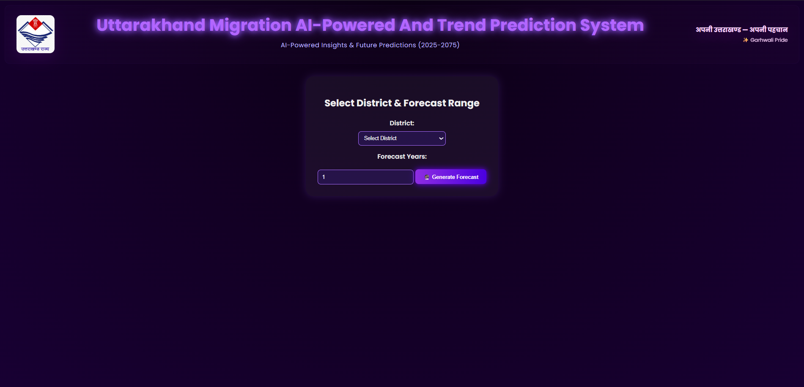
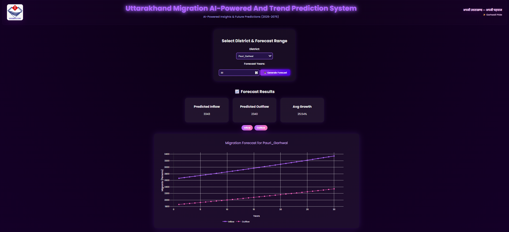
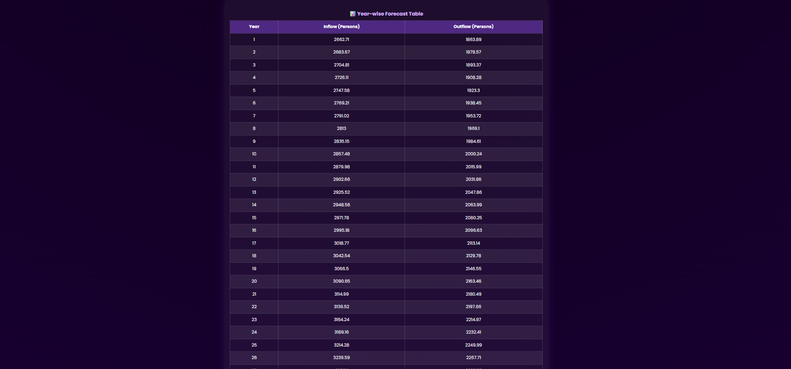

🏔️ Uttarakhand Migration AI-Powered & Trend Prediction System(2025–2075)
🚀 Overview

The Uttarakhand Migration Forecasting System is an AI-driven analytical platform designed to predict future migration inflow and outflow for every district of Uttarakhand.
It provides long-term projections up to 50 years, interactive visualizations, district-specific insights, and possible migration reasons — all inside an elegant, animated dashboard.

This project was developed as part of the State Level Hackathon organized during the celebration of Uttarakhand’s 25th Anniversary (Rajat Jayanti).

🎯 Key Features
✅ District-Level Forecasting

Predicts inflow, outflow, and average migration growth.

Forecast range: 5, 10, 15, … up to 50 years.

✅ Interactive Animated Dashboard

Plotly-powered inflow/outflow trend graph

Year-wise forecast table

District-wise migration reasons

Fully responsive neon-purple animated UI

✅ Machine Learning Integration

ML Model: Random Forest Regressor

Predicts baseline inflow using demographic & migration features

Outflow estimated using government-based migration behavior ratio

Model evaluation: MAE, RMSE, R² for accuracy measurement

✅ Data Analysis & Insights

Using official Census of India migration tables, various insights were extracted:

Highest migration inflow districts: Dehradun, Haridwar, Udham Singh Nagar

Top source states: Uttar Pradesh & Bihar

Migration type: Mainly Rural → Urban

Gender distribution: ~61% Female, ~39% Male

Age group most involved: 20–39 years

✅ End-to-End Implementation

Jupyter Notebook for data cleaning, visualization, ML modeling

Flask backend for model serving

JavaScript + Plotly for dynamic charts

HTML/CSS for animated UI

🗂️ Tech Stack
Frontend

HTML, CSS

Plotly.js

JavaScript

Backend

Python

Flask

Pandas, NumPy

Machine Learning

Scikit-learn RandomForestRegressor

Joblib (for model saving/loading)

📊 Dataset Information

This project uses official government migration data from:

🔗 Census of India — Migration D-Series Tables (2011)

Official Source: https://censusindia.gov.in/nada/index.php/catalog/11306

The dataset was cleaned, merged, transformed and stored as:
Final_MIGRATION_DATA_SET.xlsx

🧠 Machine Learning Approach
1️⃣ Feature Engineering

Age group distributions

Area type (Urban/Rural)

District attributes

Last residence patterns

Extra binary flags (e.g., Urban classification)

2️⃣ Model

Random Forest Regressor trained to estimate inflow

Accuracy measured using:

MAE

RMSE

R² Score

3️⃣ Forecast Logic

Forecast inflow using ML baseline

Outflow = 70% of inflow (based on census migration behavior patterns)

Growth rate applied:

Urban districts ≈ higher growth

Rural districts ≈ moderate growth

🧪 Features of the Dashboard
✔ Animated Trend Graph

Pink Line → Inflow

Dotted Purple Line → Outflow

✔ Auto-Generated Table

Year-wise forecast

Updated instantly with district selection

✔ District-wise Migration Reasons

Examples:

Dehradun → Employment, Education, Urban Facilities

Haridwar → Industrial Jobs, Infrastructure, Family Movement

Pithoragarh → Climate Stress, Agriculture Distress

✔ Clean Neon UI

Animated headers

Smooth interactions

Professional theme

📸 Project Screenshots:
<h3 align="center">📌 Main Dashboard</h3>

  

<h3 align="center">📌 Migration Forecast Graph</h3>

  

<h3 align="center">📌 Year-wise Forecast Table</h3>

  

📂 Project Structure
|-- app.py
|-- models/
|     |-- best_pipeline.pkl
|     |-- feature_names.pkl
|-- templates/
|     |-- index.html
|-- static/
|     |-- style.css
|     |-- app.js
|-- data/
|     |-- Final_MIGRATION_DATA_SET.xlsx
|-- README.md

▶️ How to Run Locally
1. Clone Repository
git clone https://github.com/your-username/uttarakhand-migration-forecasting.git
cd uttarakhand-migration-forecasting

2. Create Virtual Environment
python -m venv venv

3. Activate venv
venv\Scripts\activate        (Windows)

4. Install Dependencies
pip install -r requirements.txt

5. Run Flask App
python app.py

6. Open in Browser
http://127.0.0.1:5000/

📌 Future Improvements

SHAP explainability

Deep learning sequence forecasting

District-level anomaly detection

More migration attributes (occupation, education, climate)

Full Uttarakhand migration policy simulation

🏁 Conclusion

This system offers a futuristic view of how population movement may shape Uttarakhand in upcoming decades.
It provides meaningful insight for policy makers, planners, researchers, and administrators, helping them understand demographic trends with AI-powered precision.
